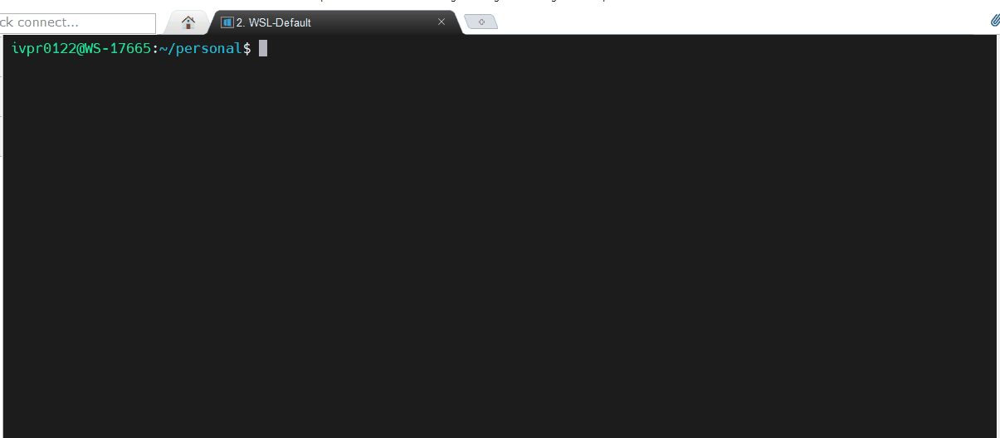
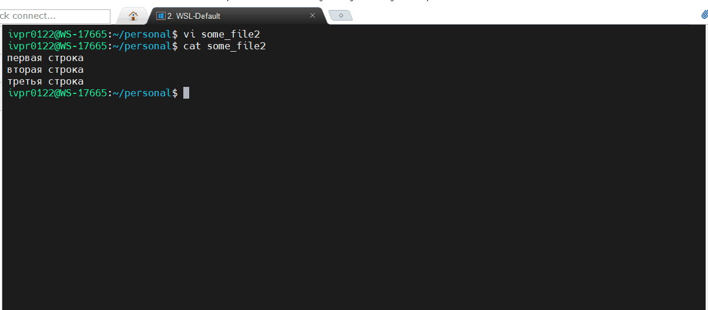
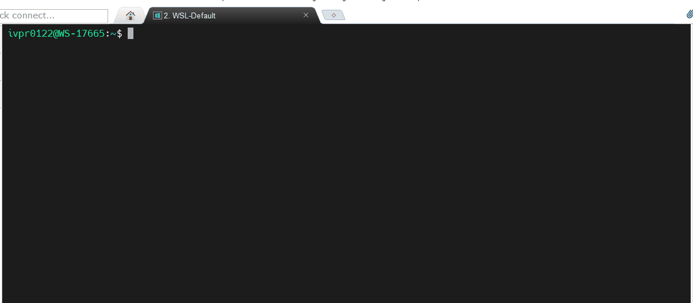

### Отчет по л/р 1:
1) Выполнить практическую часть по директориям, файлам и grep:
- Создать директорию
- Создать файл
- Переименовать директорию

```bash
mkdir sample_dir
touch sample_dir/some_file
mv sample_dir another_dir
```
2) При помощи текстового редактора vi написать 3 строки вида:
```
первая строка
вторая строка
третья строка
```


3) Сохранить файл, выйти из текстового редактора vi, вновь открыть файл для
      редактирования, удалить вторую строчку:
```
первая строка
третья строка
(не должно быть пустой строки)
```

4) Переместить созданный файл в созданную папку
```
mv some_file2 another_dir/
```
5) Скопировать папку с файлом в папку /root
```bash
sudo su
mv another_dir /root
```
6) Установить файловый менеджер mc
```
 sudo apt-get install mc
```
7-11) Открыть mc и перейти в папку /root  
Открыть файл и отредактировать текстовый файл в скопированной папке
(/root/”папка”/”файл”) при помощи встроенного текстового редактора mcedit  
Удалить вторую строку  
Выйти без сохранения изменений и выйти из mc  
При помощи команды grep найти символ из второй строки файла в папке
    /root/”папка”

