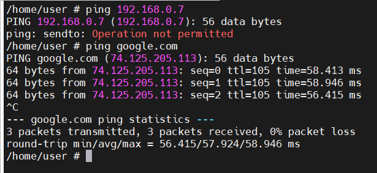

## Prerequisites
- OS: Alpine linux Standard  
- Виртулизация: VirtualBox   
- Сетевой адаптер для OS: Bridge  
```bash
apk add iptables
```

## Начальная конфигурация
### Выполнение команды ipconfig на хостовой машине windows

### Выполнение команды ifconfig на гостевой машине linux 

### Просмотр iptables правил на linux машине

### Схема сети


## Отчет по л/р 2:
1) Запретить «пинговать» виртуальную машину с linux с хостового windows.

```bash
# Добавляем новое правило в таблицу filter в chain INPUT 
iptables -A INPUT -p icmp --icmp-type echo-request -j DROP
```

```bash
# Удаляем все правила в системных chains в таблице filter 
iptables -F
```
2) Запретить «пинговать» хостовый windows с виртуальной машины с linux
```bash
# Добавляем новое правило в таблицу filter в chain OUTPUT 
iptables -A OUTPUT -d 192.168.0.7 -p icmp --icmp-type echo-request -j REJECT
```

```bash
# Удаляем все правила в системных chains в таблице filter 
iptables -F
```
3) Запретить все подключения к linux (при помощи iptables)
```bash
iptables -A INPUT -j DROP
```


4) Разрешить ssh подключение к linux с windows (подключаться через программу
   putty)
```bash
iptables -A INPUT -s 192.168.0.7 -p tcp --destination-port 22 -j ACCEPT
```

5) Сохранить записанные правила iptables в файл
```bash
iptables-save > /etc/iptables.rules
```

6) Настроить автоматическое подключение сохраненных правил iptables при
   включении виртуальной машины с linux

```bash
# Перезаписать содержимое файла /etc/network/interfaces на следущее:
auto lo
iface lo inet loopback

auto eth0
iface eth0 inet dhcp
pre-up iptables-restore < /etc/iptables.rules
```

7)  Настроить логирование подключений. Подключиться к виртуальной машине по
    ssh и найти в логах запись о подключении. (Используя grep)
```bash
iptables -R INPUT 1 -j LOG -s 192.168.0.7 -p tcp --destination-port 22 --log-level info --log-prefix "IPTABLES NEW SSH CONNECTION: "
```


8) Подключиться по ssh на другой порт (использовать iptables, а не конфигурацию
   ssh)
```bash
iptables -t nat -A PREROUTING -p tcp -d 192.168.0.30 --dport 6022 -j REDIRECT --to-ports 22
```

