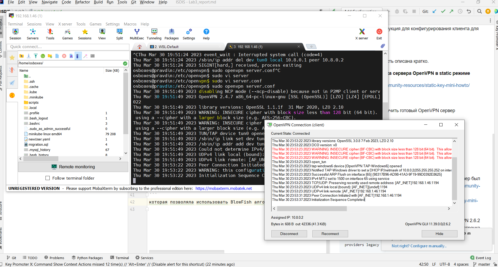

### Гайды для установки OpenVPN
#### Подробный гайд для сетапа OpenVPN в TLS режиме.
https://habr.com/ru/post/233971/#ancHardware  
Достоинства:
1) Приведена нужная для понимания принципов теория и базовая терминология
2) Подробная инструкция для конфигурированием серверной и клиентской части OpenVPN.
3) Кроме настройки OpenVPN сервера, приведена инструкция по созданию CA сервера и настройки proxy на VPN сервере.
4) Приведена инструкция для конфигурирования OpenVPN на FreeBSD

Недостатки:   
1) С практической точки зрения гайд устарел, нет описания работы с утилитой openvpn, которая ставится вместе с пакетом openvpn.
2) Предложенная настройка в качестве тестового стенда может оказаться усложненной.

#### Установка и настройка сервера OpenVPN на UBUNTU
https://www.digitalocean.com/community/tutorials/how-to-set-up-and-configure-an-openvpn-server-on-ubuntu-20-04-ru#  
Достоинства:
1) Подробная инструкция для конфигурированием серверной и клиентской части OpenVPN.
2) Присутсвует инструкция для конфигурирования клиента для android и ios.

Недостатки:
1) Теоретическая часть описана кратко.

#### Установка и настройка сервера OpenVPN в static режиме
https://openvpn.net/community-resources/static-key-mini-howto/

Достоинства:
1) Очень просто получить готовый OpenVPN сервер

Недостатки:
1) Отсутствие теории
2) Отсутствие пошаговых рекомендаций

### Результат
Для тестирования возможности OpenVPN было принято использовать static режим 
работы сервера, для этого сервер был установлен с помощью инструкции https://openvpn.net/community-resources/how-to/#openvpn-quickstart и сконфигурирован 
с помощью https://openvpn.net/community-resources/static-key-mini-howto/ инструкции.

Из-за новой версии OpenSSL 3.0, поставляемой с OpenVPN 2.6.2 клиентом, в конфиг клиента была добавлена следующая строчка
```
providers legacy default
```
которая позволяла использовать BlowFish алгоритм.


